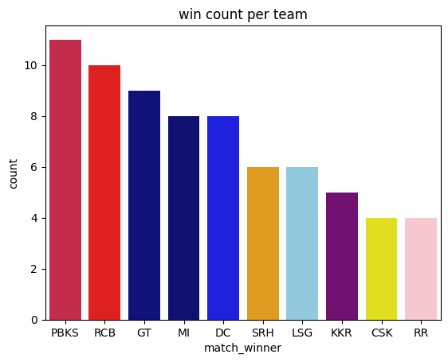
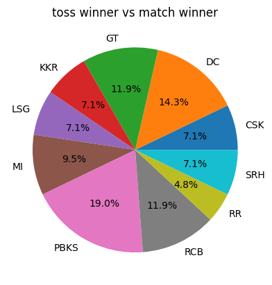

🧾 Project Overview

This project focuses on Exploratory Data Analysis (EDA) of the IPL 2025 season using Python.
The dataset matches.csv contains match-level information such as teams, winners, venues, and match outcomes from the ongoing or completed 2025 IPL season.

The primary goal of this project is to analyze team performances, match outcomes, and trends through visual exploration.
Using libraries like Pandas, Seaborn, and Matplotlib, the project highlights how each team performed during the 2025 season and identifies key patterns in wins and gameplay.

A small amount of feature engineering is performed to make the data more insightful — such as creating new columns that better represent match statistics.

🎯 Objectives

Explore and visualize IPL 2025 match data

Identify top-performing teams

Analyze toss results vs match outcomes

Create visualizations using IPL 2025 team colors

Perform light feature engineering for enhanced analysis

📊 Key Insights

Which team dominated IPL 2025

How toss decisions affected match outcomes

Team-wise win distribution

Match trends and patterns during the 2025 season

Conclusion

After performing exploratory data analysis (EDA) on the IPL 2025 dataset, several insights were observed:

Match Winners & Trends: The distribution of match winners shows certain teams dominated more games in 2025. This can help in understanding team performance trends.

Key Metrics: Basic statistics and visualizations highlighted patterns in scores, wickets, and other match-related metrics.

Data Quality: The dataset was fairly clean with minor preprocessing required, which made feature analysis and visualizations straightforward.

EDA & Feature Engineering: Initial feature engineering, such as creating dummy variables, helped prepare the data for any further predictive modeling.

Overall, the analysis provides a foundation for deeper insights into IPL 2025 performance trends and can be extended to predictive analytics in the future.